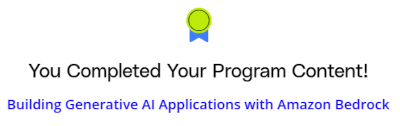

# Generative AI with AWS Bedrock

## Project: Building Generative AI Applications with Amazon Bedrock and Python

### Summary

In this project, you'll leverage Amazon Bedrock to create an intelligent document querying system, showcasing the real-world applications of generative AI. You'll combine this with other AWS services to build a GenAI RAG solution:

 - **AWS Bedrock**: The cornerstone of our project, where you'll implement and interact with large language models.
 - **Aurora Postgres Serverless**: A scalable, serverless database to efficiently store and manage your data.
 - **Amazon S3**: Object storage for housing your document corpus.

#### Construct a system that can:

1. Ingest and store documents
2. Process and index this information for AI consumption
3. Use Bedrock's language models to understand and respond to queries about the stored information
4. Apply measures to secure the GenAI pipeline

### Outcomes:

- Develop Python scripts to interact with Bedrock and other AWS services
- Understand how to integrate AI models with traditional data storage solutions
- Learn to use Terraform for Infrastructure as Code (IaC) in AI projects

